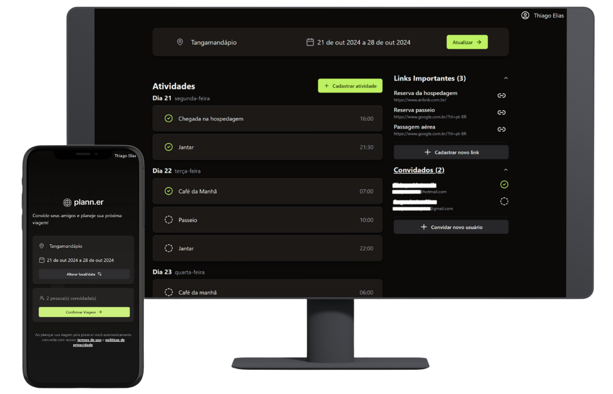
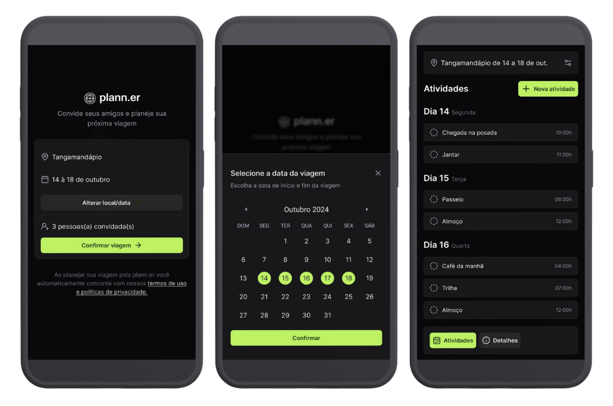
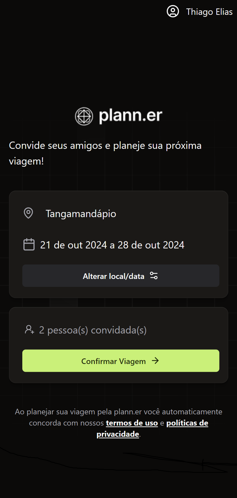
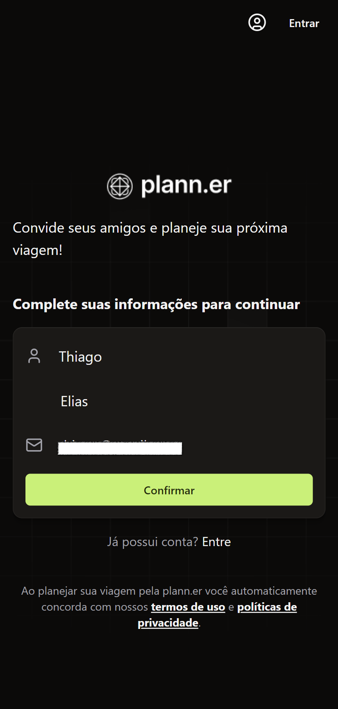
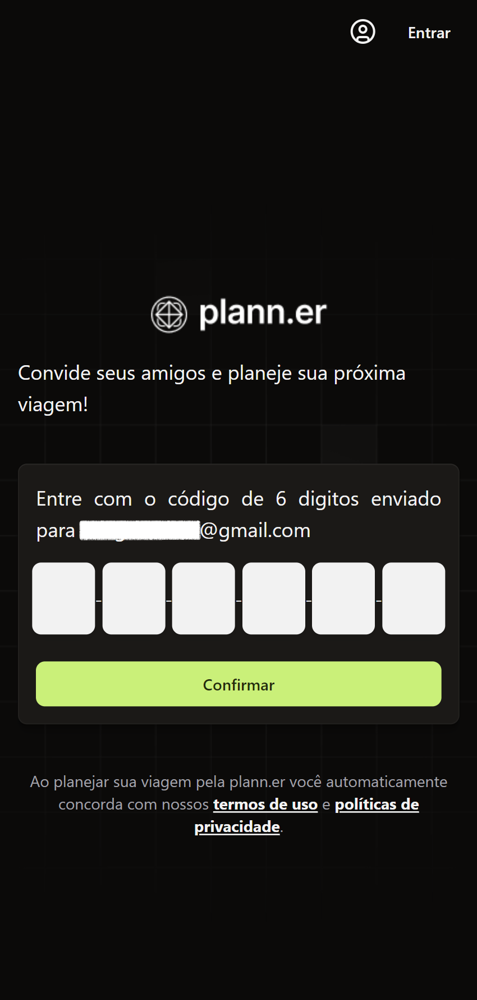
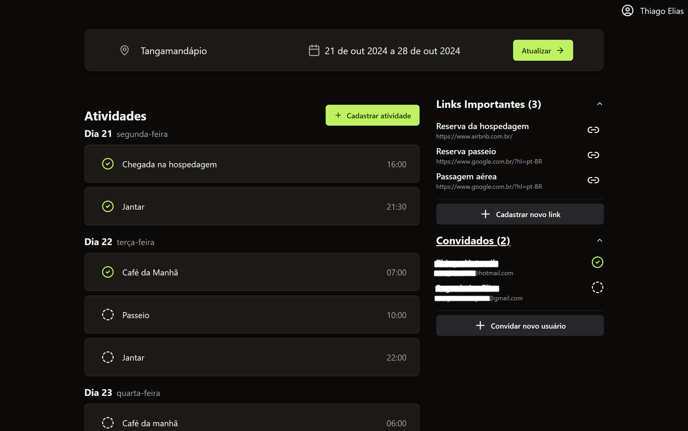

<h1 align="center">NLW - Plann.er (in development)</h1> 

### **Introduction**
This app was proposed in a NLW event from [RocketSeat](https://www.rocketseat.com.br/) and its objective is to develop an application where a user can create a trip, invite guest and manage activities.   
I decided to implement using NextJs as web front-end and back-end; and React Native Expo for a mobile version.

### **User Interface**
- [Figma](https://www.figma.com/design/mPYb3uPd3Tv6ebsqeJ3GoZ/NLW-Journey-%E2%80%A2-Planejador-de-viagem-(Community)?node-id=0-1&t=Sd8vCzrR7iUMR9U7-0)

### **Main Stack**
- NextJs for web front end and back end.
  - Tailwind UI + Shadcn UI for interfaces.
  - Mobile first ui development.
  - React Query for data fetch.
  - React Hook Form for inputs.

### **Gallery**

### **ROADMAP**
#### **Create Trip**
- [X] Trip schema
- [X] Create trip schema
- [X] Create trip endpoint
- [X] Create trip form
- [X] Firebase + Firestore
- [X] Trip Services
- [X] Email Service
- [X] Send Email to Owner
- [X] Confirm trip endpoint
- [X] Send email to guests
- [X] Redirect to trip details
- [X] Auto create if logged

#### **Trips**
- [X] List owned trips
- [X] List invited trips
- [X] Order by date
- [ ] Group concluded
- [ ] Delete trip
- [X] Guest open trip
- [ ] Calendar visualization

#### **Links**
- [X] Links schema
- [X] Create link endpoint
- [X] Link form
- [X] List links
- [X] Navigate to link
- [X] Delete Links
- [X] Collapse in SM
- [X] Empty message

#### **Create Activities**
- [X] Activity schema
- [X] Activity form
- [X] Save activity
- [X] List activities
- [X] Check / uncheck activity
- [X] Edit activity
- [X] Delete activity
- [ ] Show activities out-of-date
- [X] Empty message

#### **Manage Guests**
- [X] List guest
- [X] Invite guest
- [ ] Manage guests
- [X] Empty message

#### **Other**
- [ ] Deploy Next
- [X] Loadings
- [X] Desktop UI
- [X] Tablet UI
- [ ] Improve email templates

#### **Api**
- [ ] Configure server
- [ ] Configure routes