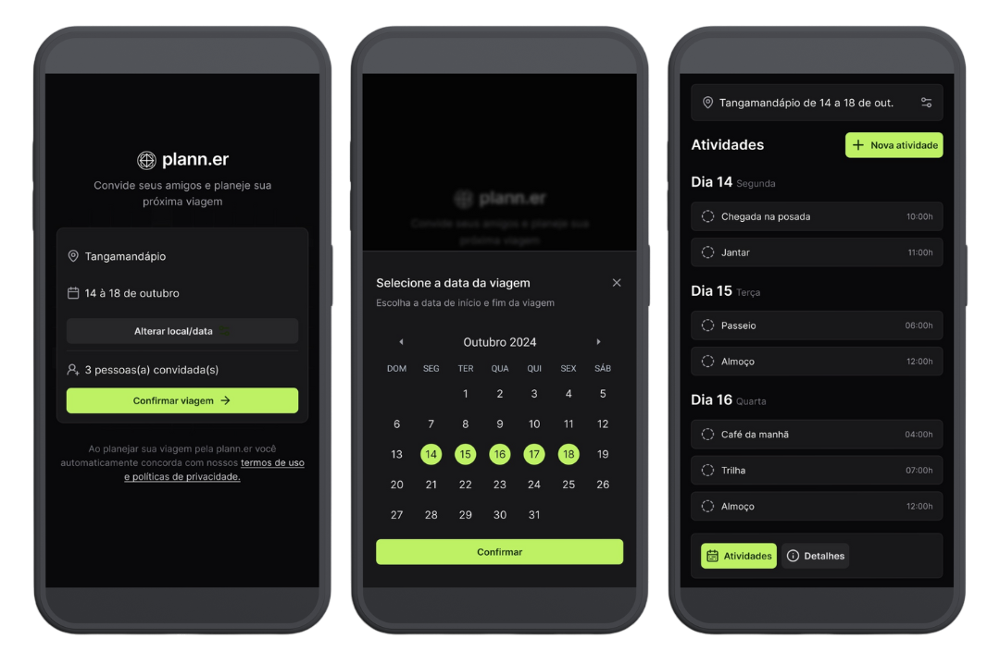
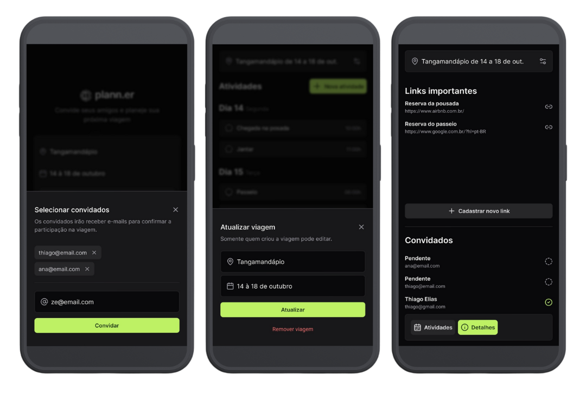

<h1 align="center">NLW - Plann.er - Expo React Native</h1> 

<p align="center">
<a href="https://expo.dev/">
  
</a>
<a href="https://reactjs.org/">
  
</a>
<a href="https://www.typescriptlang.org">

</a>
<a href="https://github.com/colinhacks/zod">
  
</a>
<a href="https://tailwindcss.com/">
  
</a>
<a href="https://github.com/colinhacks/zod">
  
</a>
</p>

<p align="center">


</p>

### **Introduction**
This app was proposed in a NLW event from [RocketSeat](https://www.rocketseat.com.br/) and its objective is to develop an application where a user can create a trip, invite guest and manage activities.   
I decided to implement using NextJs as web front-end and back-end; and React Native Expo for a mobile version.

### **User Interface**
- [Figma](https://www.figma.com/design/mPYb3uPd3Tv6ebsqeJ3GoZ/NLW-Journey-%E2%80%A2-Planejador-de-viagem-(Community)?node-id=0-1&t=Sd8vCzrR7iUMR9U7-0)

## **Running the project**
### **Developed with Expo React Native**

### **Requirements**
- [***Node.js***](https://nodejs.org/en)

### **Install**
```bash
npm install
```

### **Running development build**
```bash
npm run start 
```